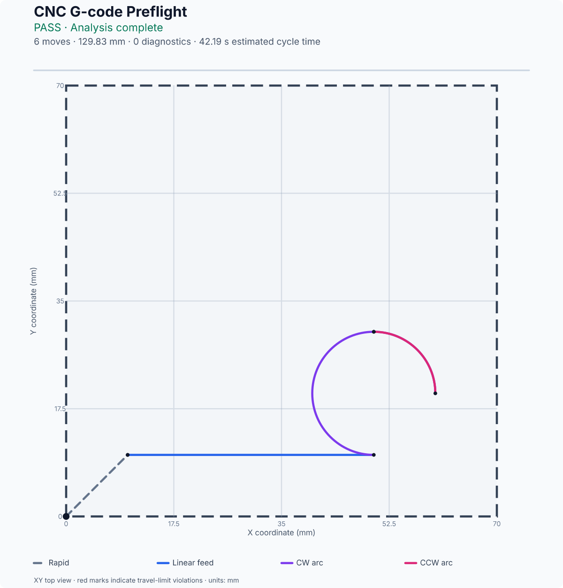
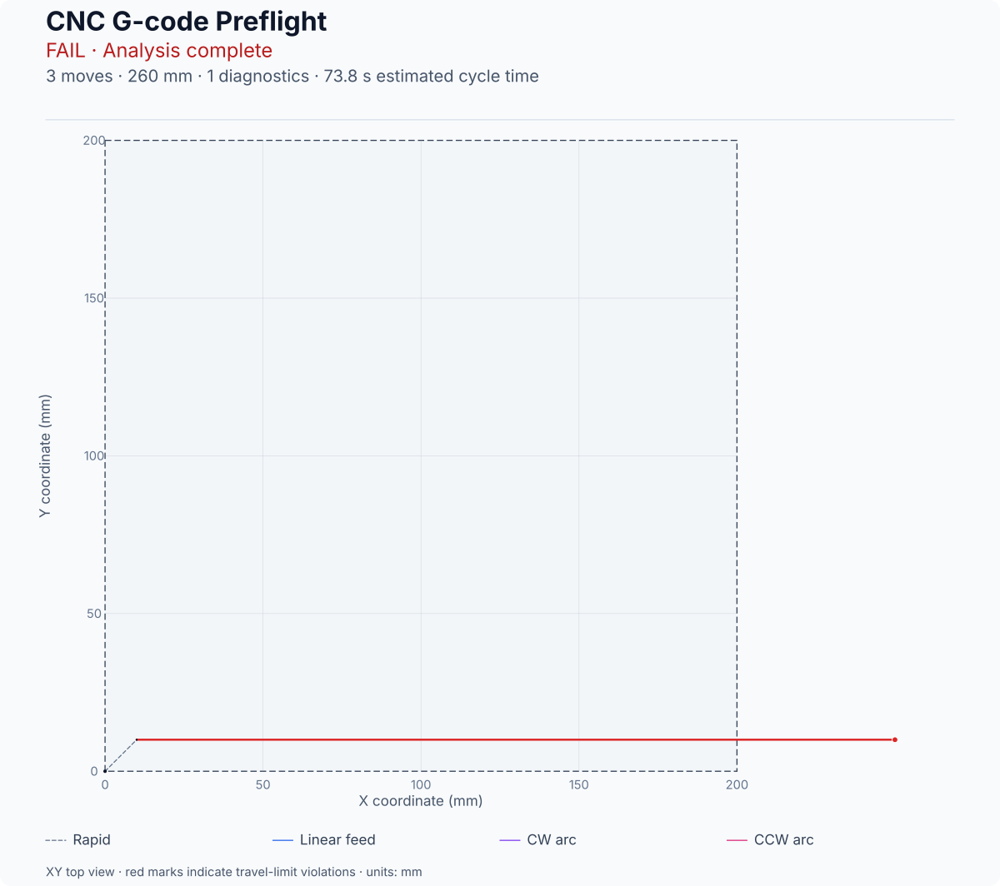
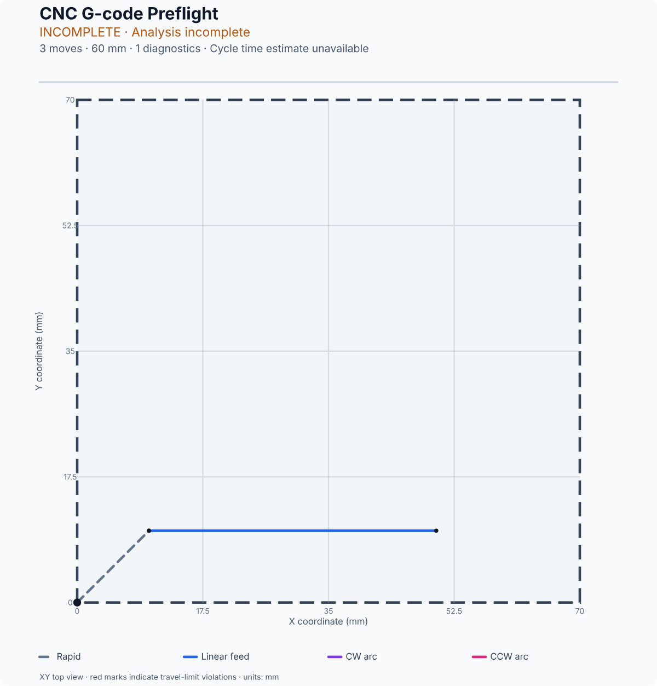
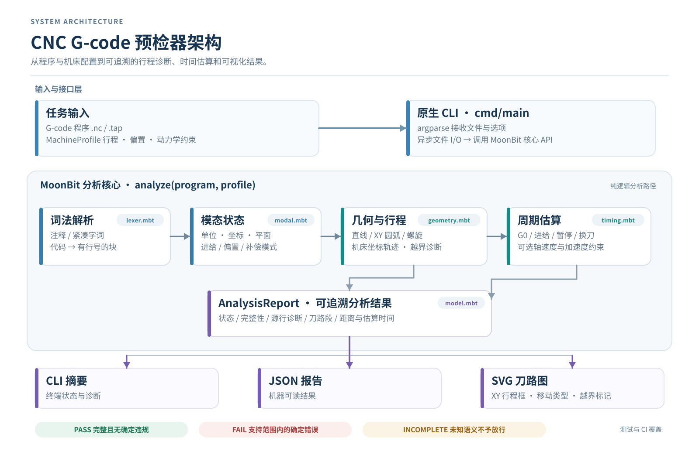

# CNC G-code 预检器

[持续集成状态](https://github.com/gckbbrant/gcode-preflight/actions/workflows/ci.yml)

一个用 MoonBit 编写的本地命令行工具。它读取三轴铣削 G-code 程序和机床配置，检查支持范围内的运动是否超出行程，估算程序运行时间，并输出 XY 刀路图。

## 运行示例

需要安装 MoonBit 工具链。项目使用的 CLI 版本见 [`moonbit-version`](moonbit-version)。

```sh
moon update
moon run --target native cmd/main -- check samples/valid.nc \
  --profile samples/profile.json \
  --svg _build/valid.svg \
  --json _build/valid-report.json
```

`PASS` 返回成功退出码；`FAIL` 和 `INCOMPLETE` 返回非零退出码。

## 示例结果

这些 SVG 由项目 CLI 根据对应的程序和机床配置生成。

**有效刀路**



**超出 X 轴行程**



**包含不支持的固定循环**



## 检查范围

- 支持三轴 XYZ，以及 G0/G1/G2/G3；圆弧使用 G17 平面，支持 I/J 圆心、有符号 R 和 Z 向螺旋插补。
- 支持 G20/G21、G90/G91、G90.1/G91.1、G94、G54-G59.3 工作坐标系和单块 G53 直线运动。
- 支持 F/S/T、M3/M4/M5、M6、M2/M30 和 G4 P。
- 按机床配置检查直线段、圆弧及弧线极值；根据快速速度、进给、暂停、换刀时间和可选轴速度/加速度限制估算运行时间。
- 核心 API 为 `analyze(program, profile) -> AnalysisReport` 和 `render_svg(report) -> String`。

宏、参数表达式、子程序、固定循环、G18/G19、刀具补偿和未实现的坐标变换不作猜测解释。它们可能影响结果时，报告状态为 `INCOMPLETE`。

## 结果状态

- **PASS**：相关指令都能完整解释，起点已知，且没有发现配置范围内的确定违规。
- **FAIL**：程序可以完整解释，但发现确定错误，例如行程超限、无效圆弧或缺少必需参数。
- **INCOMPLETE**：存在会影响运动、坐标或时间估算的未知语义。该状态不等于通过。

## 机床配置

`--profile` 接受 JSON。行程、坐标偏置和初始位置都使用毫米。程序包含运动时，必须提供初始位置，工具才能检查第一段运动。

```json
{
  "x": { "min": 0.0, "max": 200.0 },
  "y": { "min": 0.0, "max": 200.0 },
  "z": { "min": -100.0, "max": 100.0 },
  "g54_offset_mm": { "x": 0.0, "y": 0.0, "z": 0.0 },
  "additional_work_offsets_mm": [
    { "system": "G55", "offset_mm": { "x": 100.0, "y": 0.0, "z": 0.0 } }
  ],
  "initial_position_g54_mm": { "x": 0.0, "y": 0.0, "z": 0.0 },
  "rapid_mm_per_min": 3000.0,
  "axis_max_velocity_mm_per_min": { "x": 3000.0, "y": 3000.0, "z": 1800.0 },
  "axis_max_acceleration_mm_per_sec2": { "x": 500.0, "y": 500.0, "z": 300.0 },
  "arc_tolerance_mm": 0.02,
  "tool_change_seconds": 20.0
}
```

`tool_change_seconds`、每轴速度和加速度为可选项。若程序使用 M6 但未配置换刀时间，几何分析仍可进行，时间结果会标为不完整。提供加速度上限时，工具按每段从静止开始、到静止结束的梯形或三角形速度模型估算；圆弧还会考虑向心加速度。此模型不包含控制器前瞻、拐角融合、主轴升速、倍率调整或实际切削负载。

## 工作流程



命令行程序读取 G-code 和机床配置，调用 MoonBit 分析核心，再输出终端诊断、JSON 报告和 SVG 刀路图。分析过程和模块说明见 [`docs/architecture/README.md`](docs/architecture/README.md)。

## 复核

```sh
python scripts/acceptance_check.py
```

该命令运行格式检查、多目标检查与测试、CLI 回归用例，并复核示例报告、SVG 图像和架构演示文件。其他回归用例说明见 [`tests/regression/README.md`](tests/regression/README.md)。

## 相关文件

- [工程约束](docs/engineering-constraints.md)
- [Apache-2.0 许可证](LICENSE)
